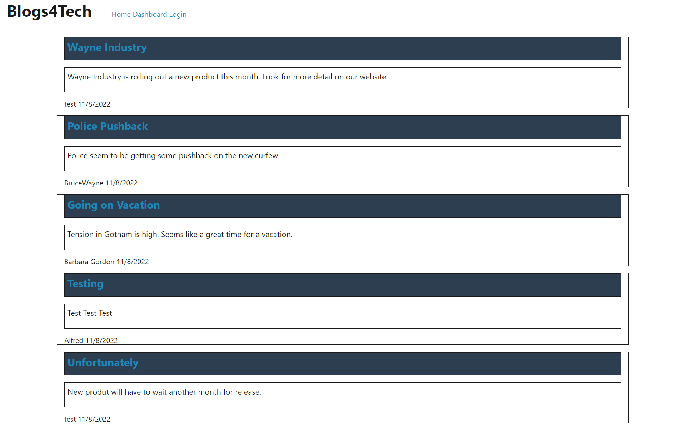

# tech-blog
  [](https://opensource.org/licenses/MIT)
  ## Table of Contents
  - [Description](#description)
  - [Installation](#installation)
  - [Useage](#useage)
  - [Contribute](#contribute)
  - [Test](#test)
  - [Questions](#questions)
  - [License](#license)
  ## Description
  Using mysql, express and handlebars I am recreating a blog site. Upon landing on the page you can view post by all users. If you sign up you can leave a comment and view your dashboard. The dashboard is where you can view all your post.

  This is a screenshot of what to expect from running the get route for categories.
  


  In this code snippet I requested all the data on products and their associated category and tags. This is done with sequelize and not mysql. 
  ```javascript
  
  ```
  You can view the repo here:
  [Github](https://github.com/johnfrom209/tech-blog)

  ## Installation
  To run this program you will first need to run "npm install" to get the dependencies. Navigate to yor mysql shell and run "source schema.sql". After that go back to your text editor and run "npm run seed". This will populate the db with seeds. Lastly, you will have to run "node server.js" while inside root folder. That is all.
  ## Useage
  
  ## Contribute
  NA
  ## Test
  NA
  ## Questions
  Github repo: [!johnfrom209](https://github.com/johnfrom209)

  linkedin: https://www.linkedin.com/in/johnfrom209/

  ## License
  The license used for this project is MIT. Get more information by checking out the repo.
